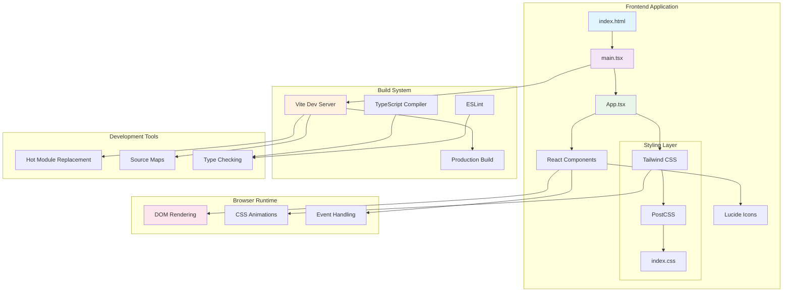

# System Architecture Documentation

## Overview
This document describes the architecture of the Enhanced Visual Design React TypeScript application, built with modern web technologies and following best practices for scalability and maintainability.

## Architecture Diagram



## Component Architecture

### Core Components
- **App.tsx**: Main application component containing the enhanced visual design
- **main.tsx**: Application entry point and React root rendering
- **index.html**: HTML template and application shell

### Styling Architecture
- **Tailwind CSS**: Utility-first CSS framework for rapid UI development
- **PostCSS**: CSS processing pipeline for optimization and vendor prefixes
- **Global Styles**: Base styles and Tailwind imports in index.css

## Data Flow

```
User Interaction → React Event Handlers → Component State Updates → DOM Re-rendering → Visual Feedback
```

### State Management
- **Local State**: Component-level state using React hooks
- **Props**: Data flow between parent and child components
- **Context**: Shared state across component tree (when needed)

## Build Process

### Development Flow
1. **Vite Dev Server** serves the application with hot module replacement
2. **TypeScript Compiler** provides real-time type checking
3. **ESLint** enforces code quality standards
4. **PostCSS** processes Tailwind CSS utilities

### Production Build
1. **TypeScript Compilation** generates JavaScript from TypeScript
2. **Vite Build** creates optimized production bundle
3. **Asset Optimization** minifies CSS, JavaScript, and images
4. **Code Splitting** enables efficient loading strategies

## Technology Stack

### Frontend Framework
- **React 18**: Modern React with concurrent features
- **TypeScript**: Static type checking and enhanced developer experience
- **Vite**: Fast build tool and development server

### Styling & UI
- **Tailwind CSS**: Utility-first CSS framework
- **Lucide React**: Beautiful, customizable icon library
- **CSS Animations**: Native CSS transitions and keyframes

### Development Tools
- **ESLint**: Code linting and quality enforcement
- **PostCSS**: CSS processing and optimization
- **Autoprefixer**: Automatic vendor prefix addition

## Performance Considerations

### Optimization Strategies
- **Tree Shaking**: Eliminates unused code from final bundle
- **Code Splitting**: Loads code on-demand for better performance
- **Asset Optimization**: Compresses and optimizes static assets
- **CSS Purging**: Removes unused CSS classes in production

### Runtime Performance
- **Virtual DOM**: Efficient DOM updates through React's reconciliation
- **Component Memoization**: Prevents unnecessary re-renders
- **Lazy Loading**: Defers loading of non-critical resources

## Security Considerations

### Build-Time Security
- **Dependency Scanning**: Regular updates and vulnerability checks
- **Type Safety**: TypeScript prevents common runtime errors
- **Linting Rules**: ESLint catches potential security issues

### Runtime Security
- **XSS Prevention**: React's built-in XSS protection
- **Content Security Policy**: Restricts resource loading
- **HTTPS Enforcement**: Secure communication in production

## Scalability & Maintainability

### Code Organization
- **Component-Based Architecture**: Modular, reusable components
- **TypeScript Integration**: Strong typing for better maintainability
- **Consistent Styling**: Tailwind CSS utility classes

### Development Workflow
- **Hot Module Replacement**: Fast development feedback loop
- **Type Checking**: Compile-time error detection
- **Code Quality**: Automated linting and formatting

## Deployment Architecture

### Build Output
```
dist/
├── index.html          # Main HTML file
├── assets/
│   ├── index-[hash].js # Main JavaScript bundle
│   ├── index-[hash].css # Compiled CSS
│   └── [assets]        # Optimized static assets
└── vite.svg           # Favicon and icons
```

### Hosting Requirements
- **Static Hosting**: Can be deployed to any static hosting service
- **CDN Support**: Optimized for content delivery networks
- **Browser Compatibility**: Supports modern browsers with ES6+ features

## Monitoring & Analytics

### Performance Monitoring
- **Core Web Vitals**: Largest Contentful Paint, First Input Delay, Cumulative Layout Shift
- **Bundle Analysis**: Monitor bundle size and composition
- **Runtime Performance**: Track component render times

### Error Tracking
- **TypeScript Errors**: Compile-time error prevention
- **Runtime Errors**: Browser console and error boundaries
- **Build Errors**: CI/CD pipeline error reporting

## Future Considerations

### Potential Enhancements
- **State Management**: Redux Toolkit or Zustand for complex state
- **Routing**: React Router for multi-page applications
- **Testing**: Jest and React Testing Library for comprehensive testing
- **PWA Features**: Service workers and offline functionality
- **API Integration**: Axios or React Query for data fetching

### Scalability Improvements
- **Micro-frontends**: Module federation for large-scale applications
- **Component Library**: Shared component system across projects
- **Design System**: Comprehensive design tokens and guidelines
- **Internationalization**: Multi-language support with react-i18next